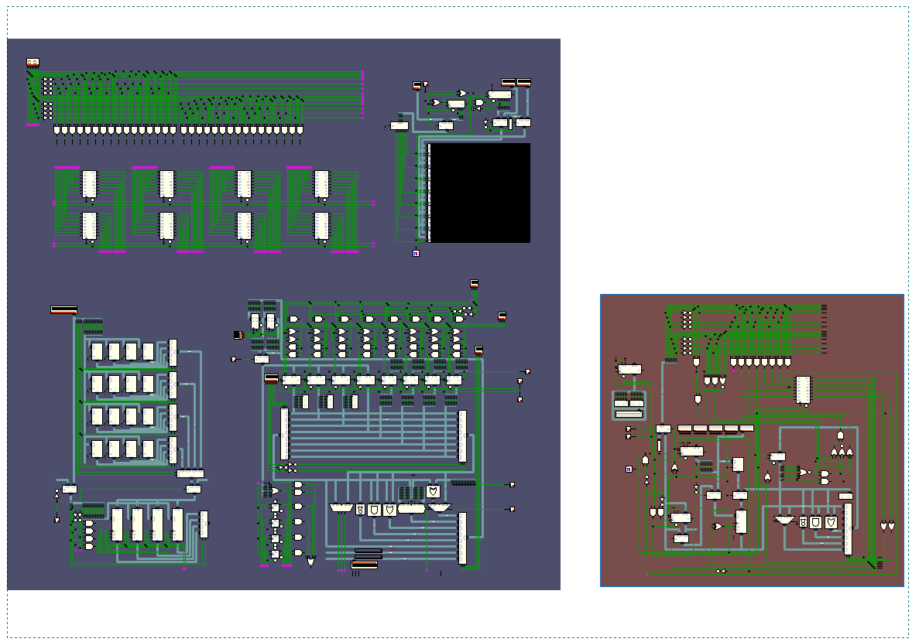

# Processador programavel 16 bits - (imcompleto/Em desenvolvimento)

## 1	Descrição do projeto

O `Processador programavel de 16 bits` é a continuação do projeto processador programavel de 8 bits, avançando tópicos de arquitetura de processador e de software

O projeto foi inicialmente baseado em microprocessadores hipotéticos como o Neander e Ahmes, os quais foram utilizados como base para a construção do primeiro processador de 8 bits. A sua continuação, o processador de 16 bits, possui como base arquiteturas de componentes reais como o intel 8008. Deste modo, o projeto se assimilaria com os desafios de hardware e software presentes ao longo do desenvolvimento das tecnologias.

## 2	Objetivo do projeto

O objetivo deste projeto é Criar uma arquitetura capáz de executar diversas instruções complexas presentes nos computadores atuais, afim der posibilitar a criação de códigos dinamicos, como um sistema operacional basico, miniaturizado. Alocação dinamica de memória, chamada de subrotina, recursividade de função

### Objetivos:
* Instruction set de 16 bits para suportar  mais códigos.
* Alocação dinamica de memória.
* Chamada de subrotina com retorno e recursividade por software.
* Suporte para periféricos de entrada e saida

Com esses dois objetivos integrados será possivel criar códigos mais complexos, como simular um disk operating system (DOS) para gerenciar arquivos e programas. Contudo, não será possivel salvar qualquer arquivo na ROM pois devido a limitação do Deeds, não há um bloco de armazenamento de memória. 

## Estrutura

Abaixo está uma comparação entre as arquiteturas do processador de 16 bits (Dentro do bloco azul) e o processador de 8 bits (Dentro do bloco vermelho). 

Atualmente o processador de 16 bits ainda está em desenvolvimento, e portanto, diversas estruturas cruciais estão faltando incluindo o roteamento dos barramentos. 

o que está contido dentro de seu bloco são estruturas desenvolvidas especificamente pare este projeto, como: Decodificador de instrução, display 64x64, modulo de memória RAM e ROM e ULA com banco de registradores. 

 

<b>Arquitetura</b>

  

## 3	Arquitetura de conjunto de instruções - ISA

### 3.1 - Instruções de alocação de memória
| Mnemônico | Código | Nome | Descrição |
| :---: | :---: | :--- | :--- |
| `LDR` | 0x0R | Load register | Carrega valor da memória para o banco de registradores. |
| `LDI` | 0x1R | Load immediate | Carrega valor constante da memória imediatamente para o um de registradores. |
| `STR` | 0x2R | Store register | Salva o valor de um registrador para um endereço de memória. |
| `STI` | 0x3R | Store immediate | Armazena valor do registrador imediatamente para o endereço atual. |
| `LDM` | 0x38 | Load Multiple | Carrega 8 valores de memória em todos os registradors do banco de registradores |
| `STM` | 0x39 | Store Multiple | Armazena o valor de todos os 8 registradores em um endereço de memória |
| `MOV` | 0x3A | Move | Move o valor de um registrador para outro. |

O segundo nibble, caso for `R`, denota a instrução reservada para denominar o registrador escolhido para realizar a instrução de carregamento ou armazenamento.

<!-- Should LDB and STB load an store imediately like LDI and STI ? -->

### 3.2 - Instruções aritméticas
| Mnemônico | Código | Nome | Descrição |
| :---: | :---: | :--- | :--- | 
| `ADD` | 0x3B | Addition |  Soma o valor de dois registradores e salva em um registrador. |
| `SUB` | 0x3C | Subtraction | Subtrai o valor de dois registradores e salva em um registrador. |
| `MUL` | 0x3D | Multiplication | multiplica o valor de dois registradores e salva em um registrador. |
| `AND` | 0x3E | AND | Operação booleana AND entre o valor de dois registradores e salva em um registrador. |
| `OR`  | 0x3F | OR | Operação booleana OR entre o valor de dois registradores e salva em um registrador. |
| `SHR` | 0x4R | Shift right | Desloca o valor de um registrador, dividindo-o por 2. |
| `SHL` | 0x5R | Shift left | Desloca o valor de um registrador, multiplicando-o por 2. |
| `INC` | 0x6R | Increment | Incrementa o valor de um registrador por 1. |
| `DEC` | 0x7R | Decrement | Decrementa o valor de um registrador por 1. |

O segundo byte da instrução reserva dois nibbles pare denominar os registradores os quais iram realizar a operação. O registrador escolhido do primeiro nibble irá funcionar como acumulador, armazenando o valor da operação em si mesmo, exemplo:| 0x61 | 0x12 | --> R1 = R1 + R2;

### 3.3 - Instruções de pulos de memória
| Mnemônico | Código | Nome | Descrição |
| :---: | :---: | :--- | :--- |
| `JMP` | 0x9R | Jump | Realiza um "pulo" sem condição para o endereço especificado. |
| `JZ`  | 0xAR | Jump zero | Realiza um "pulo" com condição; registrador especificado igual a 0, para o endereço especificado. |
| `JN`  | 0xBR | Jump negative | Realiza um "pulo" com condição; registrador especificado negativo, para o endereço especificado. |
| `JOF` | 0xCR | Jump overflow | Realiza um "pulo" com condição; Flag de overflow ligada, para o endereço especificado. |
| `JEQ` | 0xD0 | Jump equivalent | Realiza um "pulo" com condição; registrador A `igual` a registrador B, para o endereço especificado. |
| `JLT` | 0xD1 | Jump larger than | Realiza um "pulo" com condição; registrador A `maior` que registrador B, para o endereço especificado. |
| `JST` | 0xD2 | Jump smaller than | Realiza um "pulo" com condição; registrador A `menor` que registrador B, para o endereço especificado. |
| `SBR` | 0xD3 | Subroutine | Salva o endereço atual em um registrador e realiza um "pulo" sem condição para o endereço da sub-rotina especificado. |
| `RET` | 0xD4 | Return | Retorna da subroutina para o ultimo endereço de onde foi chamado  |

### 3.4 - Instruções de periféricos
| Mnemônico | Código | Nome |  Descrição |
| :---: | :---: | :--- | :---: | 
| `INP` | 0xE0 | Input | Carrega o valor do registrador de input para o banco de registrador. |
| `OUT` | 0xE1 | Output | Salva um valor da memória no display matriz. |
| `RDM` | 0xE2 | Random | Carrega o valor do contador interno para o banco de registrador. |
| `HLT` | 0xE3 | Halt | Para o clock do processador. |

